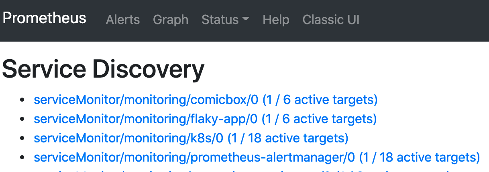
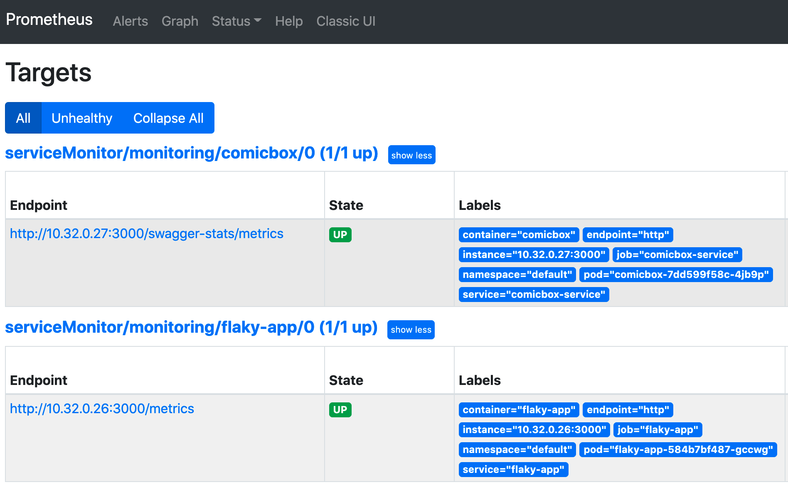

# Example KOTS App Dashbaord Graphs
The purpose of this is to provide an example of using KOTS with custom dashboard graphs provide by a deployed applicaiton.

## Using kind: ServiceMonitor
In order to deploy custom graphs in the KOTS admin console when using and embedded [kuRL](https://kurl.sh) cluster we need to deploy a ```kind: ServiceMonitor``` for our application.

The ```kind: Prometheus``` that is deployed with the kURL (embedded) cluster provides a ```serviceMonitorSelector``` that we need to define in our applications ServiceMonitor.

Example:
```yaml
kind: Prometheus
metadata:
  labels:
    app: kube-prometheus-stack-prometheus
    app.kubernetes.io/instance: v0.47.0-15.3.1
    ...
    release: v0.47.0-15.3.1
  name: k8s
  namespace: monitoring
...
   serviceMonitorSelector:
      matchLabels:
        release: v0.47.0-15.3.1
```

The value shown above is populated based on the Prometheus kURL spec defined in your ```kurl-install.yaml``` Since this value can change, as defined in the installer we use the [kURL Context](https://kots.io/reference/template-functions/kurl-context/) function ```KurlString``` and KOTS templating options to dynamic populate the correct values into our ServiceMonitor, Service and application deployment.

The [ServiceMonitor](https://github.com/soriaj/graphs-example/blob/main/manifests/comicbox-servicemonitor.yaml) file below shows use of the kURL Context function and corresponding placements. 

```yaml
apiVersion: monitoring.coreos.com/v1
kind: ServiceMonitor
metadata:
  labels:
    app: comicbox
    release: 'v{{repl KurlString "Prometheus.Version" }}'
  name: comicbox
  namespace: monitoring
...
  selector:
    matchLabels:
      app: comicbox
      release: 'v{{repl KurlString "Prometheus.Version" }}'
```

Additionally, the application [deployment](https://github.com/soriaj/graphs-example/blob/main/manifests/comicbox-deployment.yaml) and [service](https://github.com/soriaj/graphs-example/blob/main/manifests/comicbox-service.yaml) also have the applied labels. 

## Service Discovery and Targets
Once the ```kind: ServiceMonitor``` has been applied you the service (*comicbox* and *flaky-app*) should be discovered. Additionally we should also see the targets (*comicbox* and *flaky-app*).

**Service Discovery**: 



**Targets**: 



Once the service and target are available you can use the corresponding PromQL query to access the endpoints metrics.

Comicbox Metrics Example: 
```bash
sum(nodejs_process_cpu_usage_percentage) by (service)
```

This same query can then be used in the KOTS [application.yaml](https://github.com/soriaj/graphs-example/blob/main/manifests/application.yaml#L17)

```yaml
apiVersion: kots.io/v1beta1
kind: Application
metadata:
  name: prometheus-alerting
spec:
  ...
  graphs:
    - title: Flaky App Temperature (Celsius)
      query: 'temperature_celsius'
    - title: NodeJS CPU Usage (%)
      query: sum(nodejs_process_cpu_usage_percentage) by (service)
      legend: '{{ service }}'
```

For more information on using dashboard graphs with the KOTS admin console see the following link: [Dashboard Graphs](https://kots.io/vendor/config/dashboard-graphs/)